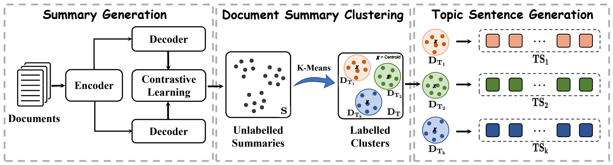

# TTSG

- The code of paper **News Topic Sentence Generation Based on Two-stage Summarization** [IJCNN](https://ieeexplore.ieee.org/document/10651550) in Proceedings of IJCNN 2024.

<div align="center">
    
</div>

## Env

Run the following command to create the required conda environment:

```
conda create -n TTSG python=3
conda activate TTSG
conda install pytorch cudatoolkit=11 -c pytorch
```

All dependencies can be installed via:

```
pip install -r requirements.txt
```

## Datasets

### 20News Group

The 20News Group dataset can be accessed from [here](https://huggingface.co/datasets/SetFit/20_newsgroups) and the downloaded file is placed in the `data` directory.

### BBC News

The BBC News dataset can be accessed from [here](https://huggingface.co/datasets/SetFit/bbc-news) and the downloaded file is placed in the `data` directory.


## How to run script

### Summary Generation
```
python BRIO/run_summary.py
```
In this section, we use the [BRIO](https://github.com/yixinL7/BRIO) approach to generate summaries.


### Document Summary Clustering
```
python k-cloest.py
```

### Topic Sentence Generation
```
bash centrum/topic.sh
```
Here, we use [Centrum](https://github.com/ratishsp/centrum) method to generate topic sentences.

## Acknowledgement

We appreciate [BRIO](https://github.com/yixinL7/BRIO), [Centrum](https://github.com/ratishsp/centrum) and many other related works for their open-source contributions.


# Citation
If you use this model or code, please cite it as follows:

```
@inproceedings{DBLP:conf/ijcnn/LinZSZL24,
  author       = {Jingwen Lin and
                  Shunan Zang and
                  Taoyu Su and
                  Chuang Zhang and
                  Tingwen Liu},
  title        = {News Topic Sentence Generation Based on Two-stage Summarization},
  booktitle    = {International Joint Conference on Neural Networks, {IJCNN} 2024, Yokohama,
                  Japan, June 30 - July 5, 2024},
  pages        = {1--7},
  publisher    = {{IEEE}},
  year         = {2024},
  url          = {https://doi.org/10.1109/IJCNN60899.2024.10651550},
  doi          = {10.1109/IJCNN60899.2024.10651550},
  timestamp    = {Thu, 19 Sep 2024 10:41:53 +0200},
  biburl       = {https://dblp.org/rec/conf/ijcnn/LinZSZL24.bib},
  bibsource    = {dblp computer science bibliography, https://dblp.org}
}
```


